# Übungszettel UML

Es werden alle Fragen des Übungszettel behandelt. Um alle Fragen anzuschauen siehe die beigelegte PFD an. 

[TOC]

## Objektorientierte Analyse

OOA ist die objektorientierte Variante der Anforderungsanalyse im Entwicklungsprozess eines Softwaresystems. Die Standardnotation ist das UML (Unified Modeling Language). In dieser Phase werden alle Aspekte der Implementierung ausgeklammert (mit Ausnahme für Anschauungszwecke für Kunden). 

**Ziele:**

- Anforderungen zu erfassen und zu beschreiben -> Probleme beschreiben, aber noch keine technische Lösung.
- Artefakte zur fachlichen Beschreibung, wie Diagramme und Darstellungen von Kontrollstrukturen
- Erstellung eines Pflichtenheftes
- Ein Produktmodell in Form eines objektorientierten Analyse-Modells (z.B Domänenmodell). Es gibt das statische (Klassen) und ein dynamisches Modell (Funktionsabläufe. Anwendungsfälle)

Beim objektorientierte Design wird aufbauend auf das Domänenmodell weiterentwickelt und ein Systementwurf erstellt. -> Dient zur Erleichterung der Implementierung in einer objektorientierter Programmiersprache.

**Requirements Engineering:**

- Anforderungen an ein neues Softwareprodukt ermitteln, spezifizieren und analysieren
- Mit fachlicher Lösung soll ein Produktmodell entwickelt werden
- Funktionale und nicht funktionale Anforderungen 

**Strukturelle Modellierung:**

- Zur Modellierung der inneren Struktur eines Systems (Strukturdiagramm)
- Die zwei wichtigsten -> Klassendiagramm und Objektdiagramm
- Im Objektdiagramm werden Objekte des Klassendiagramms zu einem bestimmten Zeitpunkt während der Ausführung dargestellt

**Dynamische Modellierung:**

- Anwendungsfälle -> Use Cases -> ist ein Verhaltensdiagramm und bildet Anwendungsfälle ab. Es wird das erwartete Verhalten eines Systems spezifiziert und ist keine Ablaufbeschreibung. Ein Anwendungsfalldiagramm enthält eine Menge von Anwendungsfällen, die durch einzelne Ellipsen dargestellt werden und eine Menge von Akteuren, die daran beteiligt sind. Diese werden durch Linien mit den entsprechenden Anwendungsfällen verbunden. Ein Rahmen um die Anwendungsfälle symbolisiert die Systemgrenzen.
- Sequenzdiagramm -> ist eine Sequenz von Verarbeitungsschritten (Szenario), welche das Hauptziel des Akteurs realisieren sollen. Es kann Fehlschlag und Erfolg abbilden, dabei werden hauptsächlich zwei Arten von Diagrammen verwendet -> Sequenz- und Kommunikationsdiagramm. Sequenz = stellt den zeitlichen Ablauf in den Vordergrund; Kommunikation = zeigt die prinzipielle Zusammenarbeit an. 
- Kommunikationsdiagramm -> dokumentiert die Zusammenarbeit von Objekten und steht dem Objektdiagramm sehr nahe. Es zeigt, wie die Objekte für die Ausführung einer bestimmten Operation zusammenarbeiten. 
- Zustandsdiagramm -> Zustand eines Objekts wird durch seine Attributwerte festgelegt, das Zustandsdiagramm bildet eine Menge von Zuständen eines Objekts dar. Dabei kann je nach Zustand eines Objekts, der gleiche Input einen anderen Output generieren. Wichtig zu wissen: Jeder Zustandsautomat (abgebildet im Zustandsdiagramm) kann jeweils nur einen Startzustand besitzen.

## Anforderungsanalyse mit Anwendungsfällen

(siehe SYP-Buch und schriftliche Mitarbeit SYP-NEMI)

- Fundament der Softwareentwicklung
- Bestimmen der Anforderungen des entwickelnden Systems (Schaukel Beispiel)
- Anforderungen des Kunden, Benutzer müssen vollständig,
  widerspruchsfrei und prüfbar sein

Es gibt zwei Methoden:

1. Kundenanforderung -> Lasten & Pflichthef
2. Benutzeranforderung -> Anwendungsfallanalyse

**Funktionale Anforderung:** 
Welche Funktionalität soll System bekommen? siehe FURPS -> Functionality -> Anwendungsfallanalyse (Analyse des Systems aus Anwendersicht) -> User Stories und ein weiteres großes Thema sind die Mock up- und Wireframes.

**Nicht funktionale Anforderung:** Was soll System darüber hinaus leisten siehe FURPS -> Usability, Reliability, Performence, Supportability (ein System das nur funktioniert wird nicht lange existieren)

Checklist: 

1. Stakeholder bestimmen
2.  Akteure bestimmen
3. Systemkontext festlegen (Schnittstellen)
4.  Benutzerziele identifizieren
5.  Detailierungsgrad bestimmen
6.  Use Case Diagramm erstellen 
7. Use Case beschreiben 
8. ergänzende Spezifikationen 
9.  Kundeninput einholen
10.  iteratives Verbessern, bis alle AF klar sind 

**User Stories:** 

- Anwendererzählungen 
- textuelle Beschreibung einer Funktionalität
- wird bei agiler Software Entwicklung verwendet
- ergänzend zur Anforderungsanalyse

Mock ups- und Wireframes; Mockup = Wegwerf Prototyp (klickbar, aber ohne Funktionalität; Wireframe = gezeichnete Entwürfe von Benutzeroberfläche -> vermittelt guten Eindruck über Funktionalität

## Anforderungsanalyse Mit User Stories und Epics

**Grundlagen Epic:** Epics enthalten die Vision, die Strategie oder die Ziele eines (Unternehmens) Systems und gelten als Leitfaden für die Entwicklung von Features. Sie werden normalerweise in User Stories unterteilt, diese wiederum besitzen die Details, um das Epic umzusetzen. Man kann also sagen, dass ein Epic ein größerer Arbeitsaufwand ist, der in kleineren Stücken unterteilt werden kann (wichtig für agiles Projektmanagement). Weiters sollten Epics Priorität haben, um sicherzustellen, dass die wichtigsten Arbeiten zuerst durchgeführt werden. Im Laufe der Zeit können sich Epics ändern, wenn zum Beispiel: neue Informationen oder Anforderungen bekannt werden. Es ist wichtig, dass Epics flexibel bleiben und Änderungen berücksichtigen können.

**Grundlagen User Stories:** Eine User Story ist eine kurze Beschreibung einer Funktion, die der Benutzer benötigt, um ein bestimmtes Ziel zu erreichen. User Stories werden in der Regel in der Sprache des Benutzers formuliert und sind aus seiner Perspektive geschrieben. Sie sind ein wichtiges Instrument im agilen Projektmanagement und dienen dazu, die Anforderungen an eine Software oder ein Produkt zu definieren und zu priorisieren. 

Drei Elemente einer User Story:

- Beschreibung des Benutzerziels
- Beschreibung der Funktion
-  Begründung, warum der Benutzer diese Funktion benötigt

Weiters sollten User Stories klein genug sein, um in einem Sprint abschließen zu können. Sie sollten auch testbar sein, so dass es möglich ist, zu überprüfen, ob sie erfolgreich umgesetzt wurden. Die Akzeptanzkriterien sollten klar definiert werden, um sicherzustellen, dass die Umsetzung der User Story den Anforderungen entspricht. Man kann im Laufe des Projekts verschiedene User Stories aktualisieren oder ergänzen (z.B: wenn neue Informationen oder Anforderungen bekannt werden). Ein wichtiger Punkt ist, dass alle Stakeholder, einschließlich des Entwicklerteams und des Kunden, an der Erstellung und Überprüfung von User Stories beteiligt sind, um zu sehen ob die Anforderungen umsetzbar sind.

Formel für das schreiben von User Stories: **Als [Kundentyp] [möchte] ich, [damit]**...

**Grundlagen Theme:** Ein Theme ist ein zusammen gefasster Begriff, der mehrere Epics oder Stories zusammenfasst. Themes dienen dazu, eine gemeinsame Idee bzw. gemeinsame Vision zu beschreiben. Epics, Stories und Themes sollten regelmäßig priorisiert werden, um die wichtigsten Anforderungen zuerst umzusetzen.

## Wichtige UML-Diagrammarten

### Klassendiagramm

beschreibt die Klassen und ihre Beziehungen in einem Softwaresystem. Durch Rechtecke dargestellt und repräsentieren konkrete Objekte. Innerhalb der Klassen können verschiedene Attribute und Methoden definiert werden, die das Verhalten der Objekte beschreiben. Zwischen den Klassen werden Beziehungen dargestellt, um ihre Interaktionen darzustellen. Die drei wichtigsten Beziehungen im Klassendiagramm sind Vererbung, Assoziation und Aggregation.

**Einsatzzweck:** In der Entwurfsphase und in der Anforderungsanalyse der Softwareentwicklung -> Findung von relevanten Klassen und Objekten. 

**Notationsformen:** 

- Klassen: werden in einem Klassendiagramm als Rechtecke dargestellt und mit dem Namen der Klasse beschriftet. In der Regel werden auch die Attribute und Methoden der Klasse innerhalb des Rechtecks angegeben.
- Vererbungshierarchie: durch Pfeile dargestellt, die von der abgeleiteten Klasse zur Basisklasse führen. Die Pfeile werden in der Regel mit dem Wort `extends` gekennzeichnet. 
- Assoziationen: repräsentieren die Beziehungen zwischen verschiedenen Klassen und Objekten -> durch Linien zwischen den Klassen dargestellt.
- Aggregation und Komposition: werden in einem Klassendiagramm durch Diamanten und Pfeile dargestellt. Aggregation -> leerer Diamanten; Komposition -> gefüllter Diamant
- Private/Public: Man kann die Instanzvariablen mit einem Plus auf public setzen und mir einem Minus auf private

**Beispiel:** Das Beispiel wurde in einer Programmierstunde erstellt. Es handelt von einem CMS-System, dabei sind die Klassen Artikel und Benutzer identifiziert worden. Beide Klassen implementieren ein Interface für die typischen CRUD-Methoden. 

.drawio.png)

### Sequenzdiagramm

dient zur Interaktionen zwischen den Objekten eines Softwaresystems auf zeitlicher Basis (Modellierung von dynamischen Zusammenhängen von Systemen). Besteht aus verschiedenen Elementen darunter sind: Objekte, Lebenslinien, Aktivitäten und Nachrichten. Hilft bei der Visualisierung des Verhaltens eines Softwaresystems auf zeitlicher Basis. Es kann zur Identifizierung von Problemen und zur Optimierung von Abläufen beitragen, bevor die Software implementiert wird.

**Einsatzzweck:** Ähnlich wie Klassendiagramm kann es in verschiedenen Phasen der Softwareentwicklung nützlich sein. Anforderungsanalyse = Anforderungen an das System besser verstehen; Entwurf = Design des Softwaresystems modellieren; Test = sehen ob die Objekte im System korrekt interagieren und die gewünschte Funktionalität erreicht wurde. Es liefert die genaueste Darstellung von Abläufen in Systemen oder Programmen. Weiters werden sie verwendet, um die Interaktionen zwischen verschiedenen Objekten in einem System zu visualisieren. Sie zeigen die Reihenfolge von Nachrichten, die zwischen den Objekten ausgetauscht werden, um eine bestimmte Funktionalität auszuführen.

**Notationsformen:** 

- Lebenslinie: repräsentieren beteiligte Objekte und werden als vertikale Linien dargestellt
- Interaktionsrahmen: Name, Übergabeparameter und Rückgabewert werden bestimmt. 
- Nachrichten: repräsentieren die Kommunikation zwischen den Objekten. Werden als Pfeile zwischen den Lebenslinien dargestellt. (asynchron -> arbeitet weiter; synchron wartet auf Nachricht bis er weiter arbeitet)
- Fragmente: Darstellung komplexer Strukturen (Schleife, Abbruch, Parallelität, Option, Alternative). Option = einseitige Verzweigung; Alternative = Mehrfachauswahl; 

**Beispiel:** In diesem Diagramm wird ein Benutzer `User` dargestellt, der eine Anfrage an ein System `System` sendet. Das System aktiviert sich, um die Anfrage zu verarbeiten und gibt dann eine Antwort zurück. Schließlich wird das System deaktiviert.(Link: [UML - Sequenzdiagramm](http://www.bs7-augsburg.de/aicher/files_codeconcert/11Prog/ANPR_UML_Sequenzdiagramm.pdf))

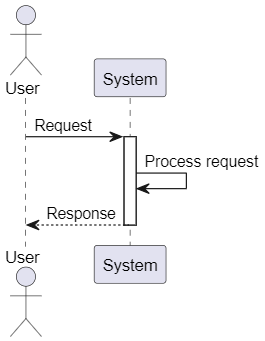

### Zustandsdiagramm

es wird das Verhalten eines Systems modelliert, indem der Zustand des Systems und die Übergänge zwischen den Zuständen dargestellt werden. Besteht aus verschiedenen Elementen darunter sind: Zustände, Übergänge, Ereignisse und Aktionen. Hilft komplexe Abläufe besser zu verstehen und zu modellieren.

**Einsatzzweck:** Ähnlich wie bei den Vorgängern kann es in verschiedenen Phasen der Softwareentwicklung eingesetzt werden. Analyse = Verhalten des Systems oder der Komponente verstehen (Probleme finden); Entwurf = verschiedenen Zustände und Übergänge spezifizieren; Implementierung = sicherzustellen, ob sich das System wie gewünscht verhält. Zustandsdiagramme werden genutzt, um entweder das Verhalten eines Systems oder die zulässige Nutzung der Schnittstelle eines Systems zu spezifizieren. Meist kommt es da zum Einsatz, wo nur das nach außen sichtbare Verhalten eines Systems beschrieben werden soll.

**Notationsformen:** 

- Zustand: bestimmter Zustand des Systems -> werden als Rechtecke mit abgerundeten Ecken dargestellt + Namen des Zustands.
- Startzustand: Anfangszustand des Systems -> gefüllter Kreis
- Endzustand: Abschlusszustand des Systems -> gefüllter Kreis mit einem Punkt in der Mitte 
- Übergang: von einem Zustand zum anderen -> als Pfeil mit einem Label in der Mitte dargestellt
- Aktion: eine Aufgabe oder ein Ereignis, das ausgeführt wird, wenn ein Übergang stattfindet -> wird als Rechteck mit abgerundeten Ecken und innerhalb des Übergangs dargestellt
- Hierarchische Zustände: hierarchische Zustände, die aus mehreren Unterzuständen bestehen -> werden als Rechteck mit einer gekrümmten Unterseite dargestellt.

**Beispiel:** Ein simpler Zustandsautomaten mit nur zwei Zuständen: `Off` und `On`. Der Automat startet im Zustand `Off`. Wenn der Benutzer die Stromversorgung einschaltet, wechselt der Automat in den Zustand `On`.

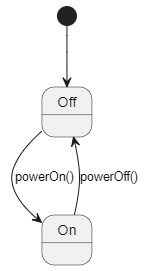

## Use-Case Diagramm 1

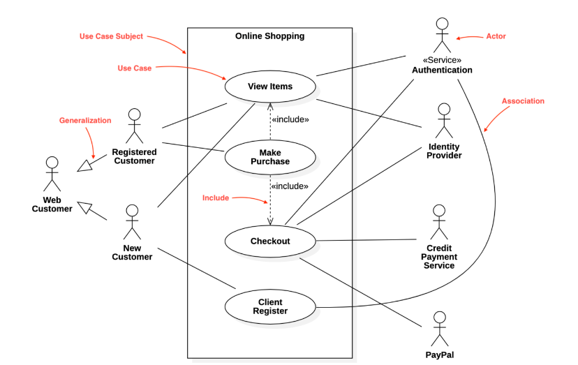

**Interpretation:** Das Use-Case Diagramm zeigt verschiedene Anwendungsfälle (Use-Cases) eines Online-Shops. Weiters zeigt es die verschiedenen Akteure, die mit dem System interagieren. 

- Akteure:  In der Abbildung sind drei verschiedene Akteure dargestellt: Kunden, Administrator und verschiedene Zahlungssysteme/Zahlungsarten. Der Kunde interagiert mit dem System, um einen beliebigen Artikel zu kaufen, der Administrator verwaltet die Artikel und das Zahlungssystem ist verantwortlich für die Abwicklung von Zahlungen.
- Use-Cases: Alle Anwendungsfälle des Systems sind als Ellipsen abgebildet. Es sind konkret vier Use-Cases zu sehen: Konto erstellen, Artikel anschauen, Artikel bestellen, Bestellung verwalten/zahlen. Diese Use-Cases beschreiben die verschiedenen Aktionen, die ein Benutzer ausführen kann, wenn er das System verwendet. Gegebenenfalls kann man auch das Anmelden von einem User als Use-Case betrachten, da es einen nicht angemeldeten Akteur und einen angemeldeten Akteur gibt. 
- Beziehungen: Abgebildet sind die Assoziationen und die Erweiterungen. Assoziationen sind durch Linien zwischen einem Akteur und einem Use-Case dargestellt und zeigen an, dass der Akteur diesen Use-Case ausführen kann. Erweiterungen sind durch gepunktete Linien zwischen zwei Use-Cases dargestellt und zeigen an, dass ein Use-Case einen anderen Use-Case erweitert -> `include`, dass heißt ohne den anderen Use-Case kann dieser Use-Case nicht durchgeführt werden. In diesem Fall erweitert der Use-Case Bestellung aufgeben den Use-Case Artikel anschauen, dass heißt Bestellung aufgeben kann nicht ohne Artikel anschauen gelingen. 

## Use-Case Diagramm 2

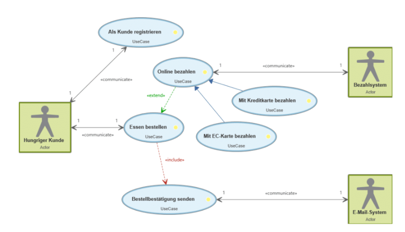

**Interpretation:** Das Use-Case Diagramm zeigt verschiedene Anwendungsfälle (Use-Cases) eines Online-Bestellservices. 

Akteure: In der Abbildung sind drei verschiedene Akteure dargestellt: Kunde, Bezahlsystem und E-Mail-System. Der Kunde interagiert mit dem System, um eine Mahlzeit zu bestellen, das Zahlungssystem ist verantwortlich für die Abwicklung von Zahlungen und das E-Mail-System kümmert sich um die Bestellbestätigungen. Der Kunde kann registriert sein muss er aber nicht. 

Use-Cases: Es sind sechs verschiedene Use-Cases dargestellt: Registrieren als Kunde, Essen bestellen, Bestellbestätigung senden, Online bezahlen, mit Kreditkarte, mit EC-Karte. 

Beziehungen: Es sind verschiedene Assoziationen eingezeichnet, zum Beispiel das der Kunde sich registrieren kann, oder auch essen bestellen kann. Dabei gibt das `communicate` an, dass der Akteur mit dem System interagieren muss, um einen erwünschten Zustand zu erhalten. Weiters kann keine Bestellbestätigung gesendet werden, sofern kein Essen bestellt wurde `include`. Die Erweiterung `extend`  beschreibt die Erweiterung eines Use-Cases, so ist zum Beispiel das Use-Case Online bezahlen ein zusätzliches Feature das Angeboten wird.

## Use-Case Diagramm 3

Beschreibung: In einem Kino kann ein Gast Kinokarten an der Kasse kaufen, die vorbestellt sein könnten. Außerdem ist es  möglich Popcorn und Getränke zu bestellen. Danach bezahlt der Kunde beim Kassierer die Rechnung. Es ist auch möglich mit Kreditkarte zu bezahlen, welche bei Bedarf einer automatischen Prüfung unterzogen werden kann.

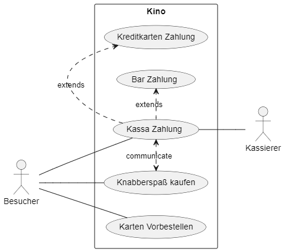

## Use-Case Detailbeschreibung

Detailbeschreibung von der Übung Kino:

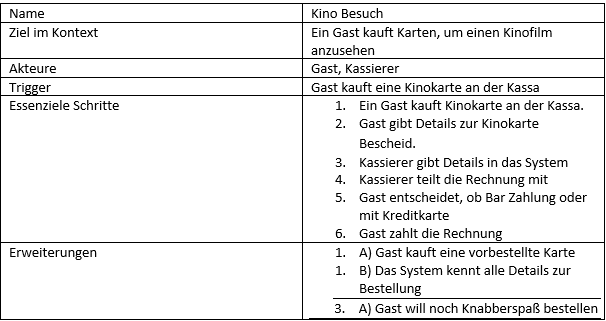

## Klassendiagramm 1

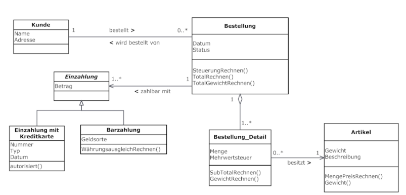

**Bestimmen Sie, ob die folgenden Aussagen zum Klassendiagramm richtig oder falsch sind.**

- [x] Es kann im System Kunden geben die nie eine Bestellung durchgeführt haben.
- [ ] Die Klasse Einzahlung ist die Oberklasse der Klasse Bestellung.
- [x] Jedes Objekt der Klasse Bestellung_Detail besitzt genau einen Artikel.
- [x] Alle Einzahlungen mit Kreditkarte haben einen Betrag.
- [x] Es ist möglich, dass ein Artikel keine Assoziation mit einem Bestellung_Detail besitzt.
- [ ] Jedes Bestellung_Detail, das Teil einer Bestellung ist, hat seinen eigenen Status und sein eigenes Datum.

## Klassendiagramm 2

Jede Person hat einen Namen, eine Telefonnummer und E-Mail. Jede Wohnadresse wird von nur einer
Person bewohnt. Es kann aber sein, dass einige Wohnadressen nicht bewohnt sind. Den Wohnadressen sind je eine Straße, eine Stadt, eine PLZ und ein Land zugeteilt. Alle Wohnadressen können bestätigt werden und als Beschriftung (für Postversand) gedruckt werden. Es gibt zwei Sorten von Personen: Student, welcher sich für ein Modul einschreiben kann und Professor, welcher einen Lohn hat. Der Student besitzt eine Matrikelnummer und eine Durchschnittsnote.

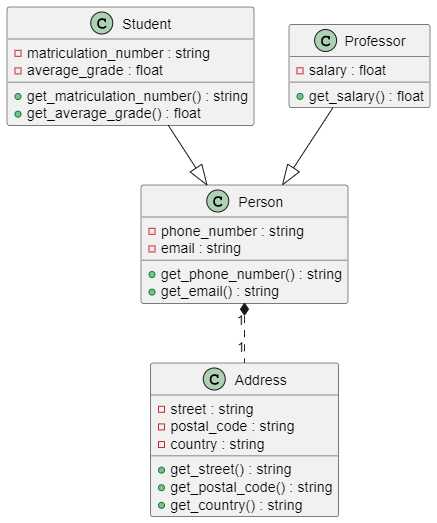

## Klassendiagramm 3

Die Videothek unterstützt das Ausleihen von Filmen für registrierte Kunden. Dazu müssen Kunden sich zunächst mit ihrer Kundennummer und ihrem Passwort anmelden. Kunden werden zusammen mit ihrem Guthaben verwaltet. Filme besitzen einen individuellen Namen und Preis. Ein Film wird über einen Streaming-Server bereitgestellt. Der Server kann hierzu einen kundenspezifischen Link generieren.

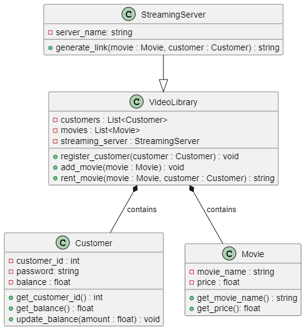

## Klassendiagramm 4

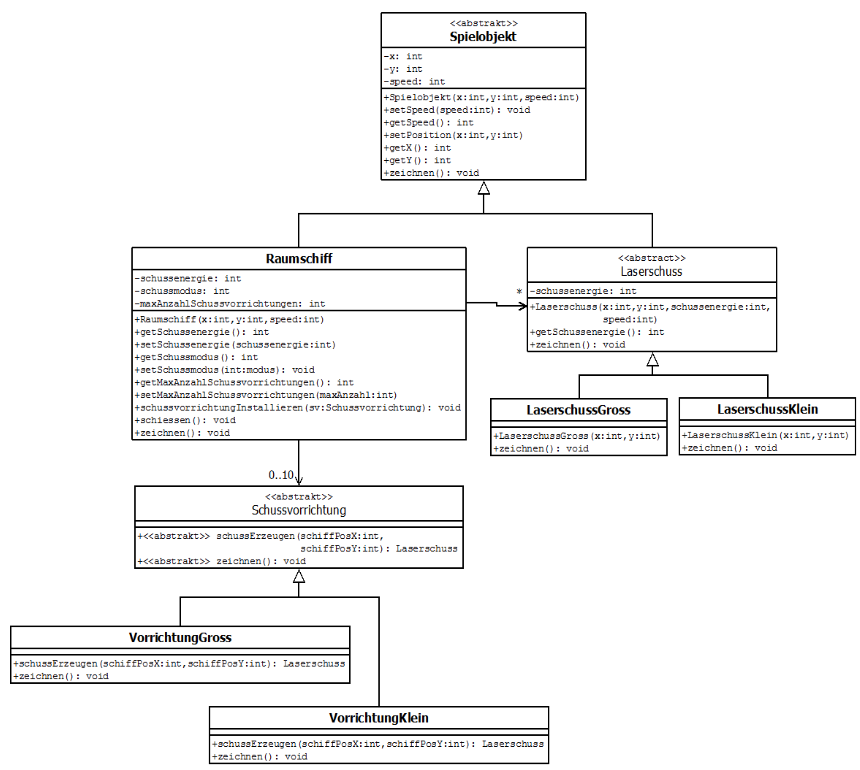

Interpretation: abstrakte Oberklasse = Spielobjekt, es erben Raumschiff und abstrakte Klasse Laserschuss. Von abstrakter Klasse Laserschuss erben die Klassen LaserschussGross und LaserSchussKlein. Alle Klassen die von abstrakten Klassen geerbt haben müssen Methoden der abstrakten Klassen aus implementieren (zumindest die letzte Klasse die geerbt hat). Ein Raumschiff kann mehrere Laserschuss haben, drüber hinaus kann ein Raumschiff (0 bis 10) Schussvorrichtungen besitzen. Diese ist ebenfalls eine abstrakte Klasse, welche von der Klasse VorrichtungGross und VorrichtungKlein implementiert wird. Alle Instanzvariablen sind private gestellt, während alle angeführten Methoden die Sichtbarkeit public besitzen. 

Das Spielobjekt besitzt Koordinaten und eine Geschwindigkeit, um die verfügbaren Objekte "zeichnen" bzw. darstellen zu können.

## Sequenzdiagramm 1

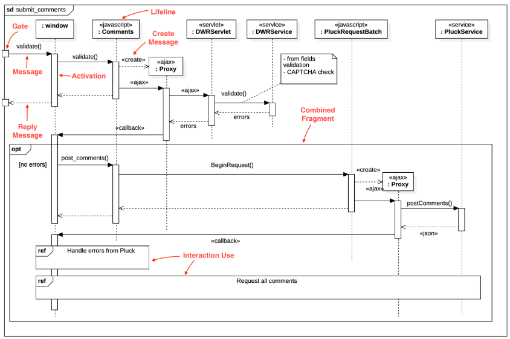

Interpretation: Benutzeroberfläche mit JavaScript und man kann Kommentare posten. Eingabe von Daten -> validieren-> Anfrage an Proxy (Vermittler - Ajax Call) -> es können Fehlermeldungen zurückgegeben werden. Nach Erstellung von Ajax Call -> können weitere Fehler zurückgegeben werden.

Von oben nach unten ist die Zeit ersichtlich -> die Methodenaufrufe warten auf die anderen Methoden damit diese sich selbst abschließen können (die Balken -> Lebenszeit der Methodenaufrufen). Opt = if abfrage...

Bei keinen Fehler -> Proxy erstellt und an Post Comment Methode weiter gegeben. Json-File wird zurückgegeben.

## Sequenzdiagramm 2

Die Videothek berechnet zuerst, ob das Guthaben des Kunden reicht um den Film zu bezahlen. Reicht das Guthaben nicht aus, wird stattdessen eine Aufforderung zum Ausfüllen des Guthabens angezeigt. Falls das aktuelle Guthaben des Mitglieds ausreicht, veranlasst die Videothek einen Streaming-Server einen Link für den Film zu generieren. Die Videothek zeigt dem Benutzer den Link an, unter dem der Film zugreifbar ist. Gehen Sie davon aus, dass sich das Mitglied bereits auf der Seite des gewünschten Films beendet.

## Aktivitätsdiagramm 1

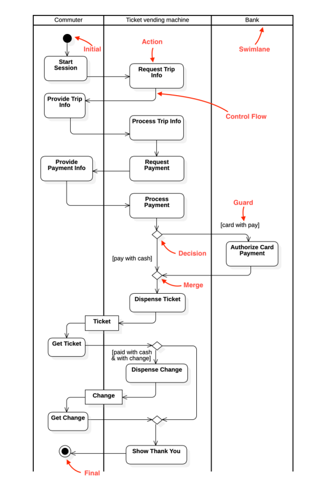

Interpretation: Der Pendler wählt eine Reise aus und der Ticketautomat setzt einen Request ab. Ticketautomat gibt die Infos an den Pendler zurück. Dieser kann die Reise bestätigen und der Ticketautomat verarbeitet diesen Prozess erneut. Der Ticketautomat gibt einen Zahlungsrequest an den Pendler, dieser muss eine Zahlungsmöglichkeit angeben. Durch die gewählte Zahlungsmöglichkeit kann der Ticketautomat, den Zahlungsporzess verarbeiten. Bei Zahlung mit Karte -> Authentifizierung mit einer Bank oder einem Kreditinstitut dazwischen geschalten. Wenn alles ohne Fehler abgelaufen ist, wirft der Ticketautomat das Ticket aus. Der Pendler kann das Ticket entnehmen und falls er Bar bezahlt hat und zu viel Geld eingeworfen hat, bekommt er vom Ticketautomaten das Wechselgeld zurück. Zum Schluss zeigt der Ticketautomat ein "Thank you" an, und der Ausgangszustand wird wieder eingenommen.

## Aktivitätsdiagramm 2

Modellieren Sie schriftlich den folgenden Sachverhalt als Aktivitätsdiagramm: Ein Fluggast ist am Flughafen angekommen. Zur Überprüfung seines Tickets begibt er sich zum Schalter seiner Fluggesellschaft. Falls das Ticket in Ordnung ist, übergibt er am Schalter sein Gepäck. Falls mit dem Ticket etwas nicht stimmt, muss der Fluggast den Kundendienst konsultieren und er kann nicht mitfliegen. Das Gepäck wird zudem auf Übergewicht überprüft. Falls dem so ist, muss der Fluggast zusätzliche Kostenübernehmen. Falls aber das Gewicht in Ordnung ist, wird die Bordkarte ausgestellt.

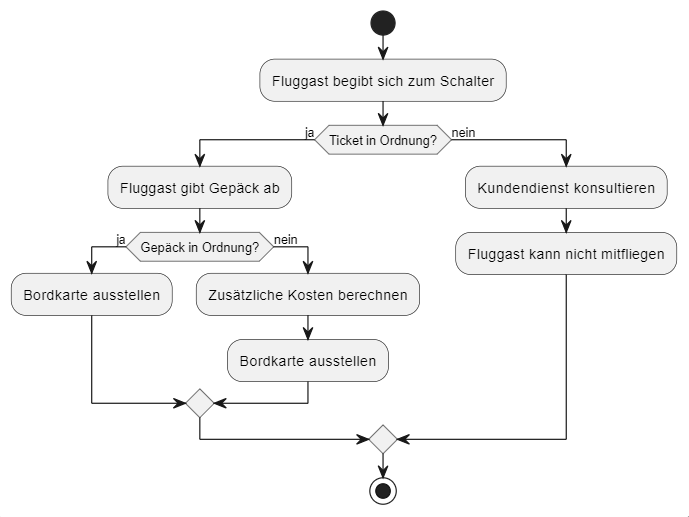

## Zustandsdiagramm 1

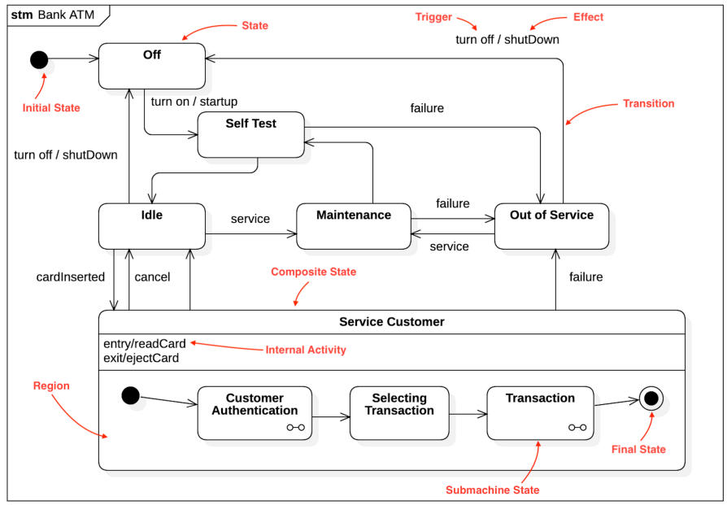

Bei diesem Beispiel handelt es sich um eine Darstellung eines Bankautomaten. Der Ausgangszustand ist ausgeschalten. Der Übergang in den nächsten Zustand lautet `turn on/startup` und bedeutet das man den Automaten einschaltet, der Zustand in dem sich der Bankautomat nun befindet ist der Selbsttest. Aus diesem Zustand können zwei verschiedene Zustände erreicht werden ->  bei Fehler = Out of Service und der nächste Übergang ist das Runterfahren des Systems; bei Erfolg = Idle (Leerlauf) und warten auf weitere Interaktion mit System. Vom Zustand Idle sind zwei weitere Zustände erreichbar, diese lauten: Maintenance (Wartung) und Service Customer mit dem Übergang der Karten Einfügung. 

Zustand Maintenance: Der Zustand der Wartung kann zum Zustand Selbsttest führen oder bei einem Fehler zum Zustand Out of Service. Dabei kann ein erneuter Service ausgeführt werden, oder das System ausgeschalten werden. 

Zustand Service Customer: Ist ein Zustand der weiter unterteilt werden kann und ist ein Composite State. Um in eines der unterteilten Zuständen zu gelangen muss die Karte gelesen und akzeptiert werden. Bei Akzeptierung, gelangt man in einen Ausgangszustand der sich Customer Authentication nennt. Danach folgen noch zwei Zustände bis man zum Endzustand gelangt. Bei Ankommen zum Endzustand innerhalb des Composite States, gelangt man erneut zum Idle Zustand. Bei Fehlern im Composite State gelangt man in den Out of Service Zustand. Bei Abbruch gelangt man in den Zustand Idle erneut. 

## Zustandsdiagramm 2

Entwerfen Sie ein Zustandsdiagramm für eine Bestellung auf Amazon. Modellieren Sie dazu die Zustände und  die Übergänge einer Bestellung vom Aufgeben der Bestellung bis hin zur Aushändigung des Paketes an den Kunden.

## C4-Diagramm

Von Simon Brown entwickelt und ist ein Modell zur Strukturierung von Software-Systemen. Es besteht aus vier Abstraktionsebenen, die dazu dienen, die Komplexität von Software-Systemen zu reduzieren und ein gemeinsames Verständnis zwischen den beteiligten Personen zu schaffen. Weiters kann das C4-Modell genutzt werden, um eine gemeinsame Architektursprache zu schaffen und komplexe Systeme zu strukturieren. Es kann helfen, Missverständnisse und Konflikte zwischen verschiedenen Stakeholdern zu vermeiden und die Kommunikation innerhalb eines Teams zu verbessern.

Die Abstraktionsebenen:

1. Kontextebene: das System wird in seinen Kontext gestellt -> es wird gezeigt, mit welchen Systemen es interagiert und welche Rollen es in der Gesamtarchitektur spielt.
2. Container-Ebene: Es werden die Container des Systems dargestellt -> Container sind eigenständige Laufzeitumgebungen, wie z.B. Anwendungs-Server, Datenbanken oder Browser. Sie enthalten eine oder mehrere Komponenten und bilden eine physische Grenze zwischen diesen Komponenten und anderen Systemen.
3. Komponenten-Ebene: Einzelne Komponenten des Systems werden dargestellt. Eine Komponente ist eine logische Einheit, die eine bestimmte Funktion erfüllt. Sie kann innerhalb eines Containers oder über mehrere Container verteilt sein.
4. Code-Ebene: Ist die Darstellung des Codes, welche eine Komponente implementiert. Dies kann ein zum Beispiel ein Klassen- oder Sequenzdiagramm sein.

**Kontext-Diagramm:** 

**Container-Diagramm:** 

**Komponenten-Diagramm:**  

**Klassendiagramm:**

